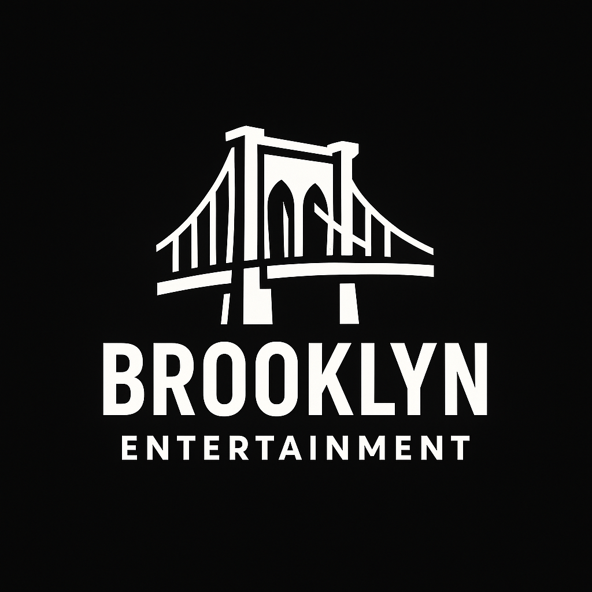

# Brooklyn Entertainment



Welcome to the official GitHub repository of **Brooklyn Entertainment** — where urban creativity meets modern entertainment.

---

## 🎯 About Us

Brooklyn Entertainment is a bold, energetic brand inspired by the iconic culture and creative vibe of Brooklyn. We specialize in bringing immersive entertainment experiences to life.

---

## 📂 Assets Included

- `brooklyn_logo_transparent.png` — Main logo (transparent background)
- `banner_1200x400.png` — Banner for GitHub Pages or websites
- `favicon_128.png` — Icon for web tab or app
- `brooklyn_logo_placeholder.svg` — SVG-format placeholder (web-embed)

---

## 🌐 Website Banner


---

## 🧠 How to Use

To add the favicon to your GitHub Pages site:

```html
<link rel="icon" href="favicon_128.png" type="image/png" />
```

To display the logo:

```markdown

```

---

## 📩 Contact

For business inquiries or collaborations, reach out at [email@example.com].

---

© 2025 Brooklyn Entertainment. All rights reserved.
